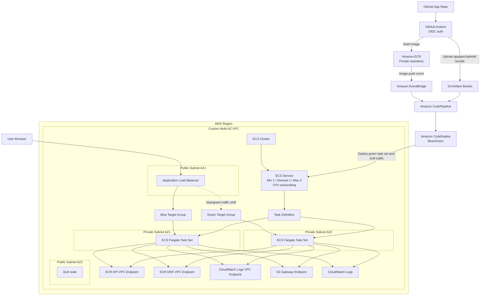

# ECS CI/CD Architecture Diagram as Code

## Notes

- Public entry point: Application Load Balancer
- Workload: ECS Fargate tasks in private subnets
- Image source: Amazon ECR
- Build pipeline: GitHub Actions with OIDC
- Deployment trigger: EventBridge on ECR image push
- Deployment orchestration: CodePipeline
- Deployment strategy: CodeDeploy blue/green
- Private service access: ECR API endpoint, ECR DKR endpoint, CloudWatch Logs endpoint, S3 gateway endpoint